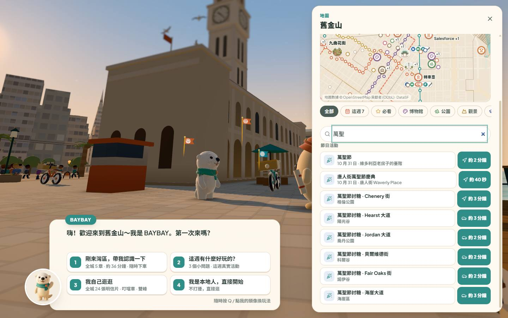
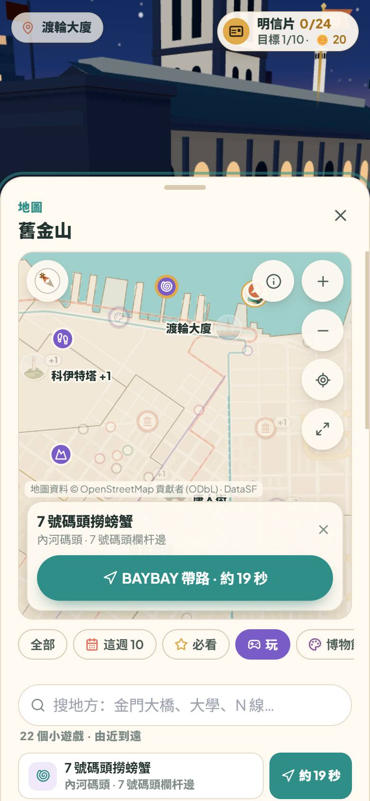

# Wave 9 · lane L · language & search

Lane L of wave 9 (plan `docs/opus-bay/sf-w9-lead.md` §3 L; review `docs/opus-bay/review-2026-10-01-first-use.md` R§5 #11,
R§6 语言与本地化). Worktree `C:/Users/willy/wt/w9-l` (branch `w9-l`), dev port 5906, scratch `C:/Users/willy/opus-qa/w9/l/`.
Times PDT, 2026-10-01 → 10-02.

## 给主人的摘要

1. **繁體搜索修好了**：地图搜索里输入「金門大橋、博物館、漁人碼頭、N 線」等繁体字，以前全部「沒找到」（评测里 19 个词只有 1 个能搜到），现在 19 个全都能搜到，和简体搜索结果完全一样；输入框里的示例词和 4 个建议词也都能用。
2. **搜索能找到小游戏和节日活动**：搜「螃蟹 / 抓娃娃 / 雾笛 / 风筝 / 酸面包 / 算命 / 街头艺人」等（中、繁、英都行）会直接列出对应的小游戏，点一下就带你去（或在原地直接开始）；搜「万圣 / Halloween / 讨糖」会列出 6 条讨糖街和 10 月 31 日唐人街万圣节庆典。搜「claw」不再出现「法学院」。
3. **繁體文字更自然**：修好了「馬里納區 → 馬裡納區」「小傢伙 → 小傢夥」「花崗岩 → 花崗巖」这类二次转换的错字（全游戏 5,080 句中文逐句验证）；游戏页里用台湾惯用词：設定、資訊、義大利、帶小孩、滑鼠、選單、搜尋，「旅行本裡」「海裡」，长度写「公尺」。网站其他页面不受影响。
4. **搜索还能"问能玩什么"**：空结果下的建议多了「小游戏」，输入「小游戏 / 好玩 / games」列出全部 24 个小游戏（和游乐图鉴一致，新补了纸板滑草、坡顶飞跃、慢慢开下弯弯街、鹈鹕穿金圈），「节日 / festival」列出近期全部活动；搜「金门」「九曲花街」仍然先出景点本身。
5. **繁體 + English 全屏扫描**：第九波新界面（地图「玩」筛选和游戏卡、游乐图鉴、捉迷藏、今日小游戏、照片卡）在繁體和英文、电脑和手机上逐屏扫描，**0 处漏翻**；新的加载 / 存档 / 相册提示改用台湾用语（載入、裝置、顯示卡、儲存、相簿、縮圖）。
6. **小字修正**：一日游路标「Welcome Center」改成「金门大桥游客中心」；英文小游戏标题「What’ s that?」中间的空隙去掉；65 岁以上免费 Muni 的来源改为 SFMTA 英文官网（2026-10-01 核对）；Exploratorium 和 Gott’s 两条网站目录在英文页不再出现中文。

## Part a — the map search (R§5 #11, lane L (1))

### What was built

- **繁體 search** (`data/sf/placeSearch.ts`): every name, alias and query goes through NFKC, then the site's
  `simplifySearch()` (`src/i18n/locale.ts`: opencc's TS dictionaries, already in the site's entry chunk), then lower
  case. The word-start rule (`wordsOf`) and the category words use the same fold, so 博物館 is the museum category.
  The chips set the displayed text (金門大橋 in 繁體): it is folded like a typed query, so no back-fill to Simplified was
  needed (decision: the input keeps the reader's script).
- **No more cross-word Latin substrings**: the old normaliser removed spaces, so "claw" matched "uc law" in "UC Law San
  Francisco". A Latin query's substring now has to sit inside the names' word gaps (`spacedSearch`); "law" still finds
  UC Law; prefix matches without spaces ("goldengate") still work through the prefix rule.
- **Games and events** (new `data/sf/searchSpots.ts`, pure data): 20 game spots — 抓娃娃机, 算命婆婆, 捞螃蟹 (Pier 7),
  捏酸面包, 雾笛对答 (Fort Point), the two buskers (Haight, 24th St), 放风筝 (Marina Green), 纸板滑梯, the three stair races,
  数海狮, 烤棉花糖, 叮当车摇铃 · 拉闸, 嘿咻推转盘, 飞盘, 沙滩球, 那是什么？, 捉迷藏 — each with zh and en aliases (繁體 is folded:
  釣螃蟹 = 钓螃蟹), the point copied from its play module (pinned to the source constants by the test, so the map chunk
  does not import the play modules), and goTo's id (the registered `play:…` interactable, else an attraction). The
  six trick-or-treat streets while the Halloween season runs (1–31 Oct; each point = the street's first standing
  door's knock spot), and the realsf calendar rows ahead (visible, with a place, starting within 60 days: the Chinatown
  Halloween Festival 10 月 31 日 · Waverly Place, Fleet Week …).
- **Two new result groups** 小游戏 / Games and 节日活动 / Events (bonus −1.5); they come before 景点 only when their best
  hit beats the sights' best (螃蟹 → 捞螃蟹 first, then 渔人码头; 金门大桥 → the bridge first). Ties: the calendar's dated
  rows before the streets.
- **The map list** (`ui/CityMapList.tsx`, lane G's file: surgical, the search rows only): a row per spot (game pad /
  party icon, name, where) with the usual go button; a tap runs the game's 问 BAYBAY item when it is offered where the
  player stands (kite on the lawn, frisbee, hide & seek …), else goes there.

### Evidence

- `tests/opus-bay-w9-l-search.test.ts` (4 tests). Before / after on the same index: the planner's 繁體 list + the
  placeholder words + the chips found **1 / 19 → 19 / 19** and each ranks exactly as its Simplified spelling; "claw" →
  `uc-law-sf` before, never after. Every game alias (zh, 繁體, en) puts the games group first with the right game; 万圣 /
  萬聖 / Halloween / 讨糖 / trick or treat → the 6 streets (+ the festival); on 10 Nov none.
- Played on the dev server (5906, `?world=city&save=off&lang=zh-Hant`, 1440 × 900, `C:/Users/willy/opus-qa/w9/l/probe1.log`):
  金門大橋 → 金門大橋 (景點), 金門大橋 · 遊客中心 (車站); 螃蟹 → 小遊戲 撈螃蟹 · 7 號碼頭 then 漁人碼頭; claw → 抓娃娃機 · 機械博物館 only;
  霧笛 → 霧笛對答; 萬聖 → 萬聖節 and 唐人街萬聖節慶典 (10 月 31 日), then the six 討糖 streets, each with its go button.
  
- `tests/opus-bay-sf-attractions.test.ts` + `sf-places` 32 / 32 (the old search tests, the group order for "castro").

### Decisions

- `data/sf/places.ts normalizeQuery` / `PlaceIndex.search` left as they were: nothing in the game calls them (only two
  old tests); folding there would add bytes to GameRoot (≈ 0.2 KB of room) for no player.
- Anywhere-games (frisbee, beach ball, 那是什么？) carry a default place (Dolores Park, Ocean Beach, Twin Peaks) for the go
  button; hide & seek has none (its row only starts it when 问 BAYBAY offers it).

## Part b — 繁體 quality and words (lane L (2) + (3))

### What was built

- **The site's cn → tw converter is safe to run twice** (`src/i18n/locale.ts taiwanConverter`, surgical). opencc keeps
  a phrase it knows (马里纳区 → 馬里納區), but a second pass over its own output goes character by character (馬裡納區,
  小傢夥, 花崗巖, 裡維拉, 裡士滿區) — and the site does convert twice: the game's `pick()` output is a JSX child that
  `i18n/host.ts` converts again. Each conversion now checks its output; when a second pass would change it, the text's
  phrases are added to the trie as themselves, so the JSX pass leaves them alone. One extra pass per string (a full scan
  of opencc's 49k phrases at load measured 120–1,370 ms here: rejected).
- **Taiwan words on the game page** (`TAIWAN_WORDS`, applied when `location.pathname` is `/opus-bay`): 設定, 資訊, 義大利,
  影片, 網路, 帶小孩, 滑鼠, 選單, 搜尋, 記憶體, 資料, 公車 / 轉運中心, 帳號, 低音管, 史特勞斯 …; 裡 where 里 means "in" and
  opencc keeps 里 (旅行本裡, 遊戲裡約, 隧道裡, 放回海裡 / 掉進海裡 / 看海裡 — w8 W2-P2's lines); 阿什伯里; metres as 公尺
  (227 米 → 227 公尺; never 米飯 / 米色 / 米其林). The rest of the site reads as before (its own tests pin 收起設置).
- **Words**: the Welcome Center's place name 金门大桥游客中心 / Golden Gate Bridge Welcome Center (`PLACE_NAME_FIXES`,
  surgical: the Grand Tour's beacon read "Welcome Center · 约 12 秒" in Chinese); English in the Noto-first font stacks
  of the play chips / cards / panels (`opus-bay.css`, surgical, next to W7's D9 line: "What’ s that?" had Noto Sans
  SC's full-width ’); the seniors' free Muni cites https://www.sfmta.com/fares/free-muni-seniors-ages-65 (the site row's
  sourceUrl; re-read 2026-10-01: "All San Francisco seniors, ages 65+, with a gross annual family income at or below
  100 percent of Bay Area Median Income level are eligible", apply first, cable cars included) and `export-live.ts`'s
  `sourceEn` override is gone (lane R's file, surgical; `live.json` and `public/baybay-guides(.en).json` re-exported:
  the URL / that row's date only); `src/data/planner-en.json`: venue-exploratorium-daytime's title ("Exploratorium ·
  Daytime science museum", as `src/lib/planner-copy.ts` words it) and summary, restaurant-gotts-ferry-building's summary.

### Evidence

- `tests/opus-bay-w9-l-hant.test.ts` (4): the stock converter is non-idempotent on the 6 review cases (kept as an
  assertion) and the new one stable; all **5,080** Chinese literals of `src/opus-bay` convert once and stay, with and
  without the words (stock: 26 moved on a second pass); the words, 裡, 公尺; `translateText(pick(x)) === pick(x)`; the
  words only on /opus-bay.
- `tests/opus-bay-w9-l-words.test.ts` (4): every Noto-first selector has its English line (7 were missing); the
  Welcome Center; the seniors' source in the site row, live.json and the guides with no override; the two catalog rows
  have no Han in English.
- Site tests green: search-cold, regional-landmark-photos, attractions-expanded, coverage-audit-sf-north,
  editorial-media-coverage, september-refresh-content, browser-locale, profile-personal-space, home-discovery,
  local-discovery, outings-ui, planner-copy + opus-bay w5-lang, w5-lang-review, w6-k2-content, w8-q-lang, w8-p-review,
  w5-calendar.

## Part c — the rest of the search, the scan over wave 9's screens, 繁體 words (W9-L6 … L9, 02:14 → 04:45 PDT)

The first agent of this lane stopped at ≈ 00:35 PDT (an account usage limit). This second agent found two uncommitted
files (`scripts/opus-sf/qa/lang-scan.mjs`: the wait for Start / the map re-open, good — kept and finished;
`data/sf/placeSearch.ts`: the 小游戏 chip and the game / festival words, good — kept, tested, pushed as W9-L6). Nothing was
discarded.

### What was built

- **W9-L6** (`data/sf/placeSearch.ts`): category words for "a game" (小游戏 · 游戏 · 玩什么 · 好玩 · games · game ·
  minigames · play → every game row) and "a festival" (节日 · 节日活动 · 节庆 · 庆典 · festival · festivals · events · holiday →
  every event ahead); the empty state's chips 金门大桥 · **小游戏** · 大学 · 石镇 · N 线. `tests/opus-bay-sf-attractions.test.ts`'s
  search index now also holds the games / events, as the map list's does (its "every suggestion finds something" would
  otherwise fail on the new chip).
- **W9-L7** (`data/sf/searchSpots.ts`): the four games of lane G's 游乐图鉴 (`ui/playDexData.ts DEX_GAMES`, W9-G1) that had
  no search row — 纸板滑草 (sled), 坡顶飞跃 (crests), 慢慢开下弯弯街 (crooked), 鹈鹕穿金圈 (ggb-rings) — points from the dex,
  pinned by the test; every dex game now has a row (24 rows; bell / grip share the cable-car row, the busker has two).
  No row is named after the landmark beside it (金门 / golden / Golden Gate / 九曲花街 / Lombard / crooked street answer the
  landmark first: a draft alias "golden rings" put the rings ahead of the bridge for "golden" — caught by the test).
- **W9-L8** (`scripts/opus-sf/qa/lang-scan.mjs`): wave 9's title (Start waits for 准备中… to end, lane P), the map
  re-opened until its search box shows, the pelican's 先试试起飞？ answered before 问 BAYBAY (lane F's W9-F5); new
  screens: `map:chip:*` (every filter chip incl. lane G's 玩) + `map:game-pin` (the pin's card), `search:games-all` (the
  小游戏 chip), `ask:play-nearby` (问 BAYBAY → 附近能玩什么？ → the journal's 游乐 tab), `hide-seek` / `hide-seek:later`,
  the result card with 今日小游戏, `photo` (lane S's city card: its painted caption / address go to the canvas list).
- **W9-L9** (`src/i18n/locale.ts TAIWAN_WORDS`, surgical, game page only): a sweep of all 5,394 Chinese literals of
  `src/opus-bay` through the game page's converter found mainland words left in wave 9's new lines — 加載 ×5, 設備 ×5,
  顯卡 ×2, 硬件 ×1, 存儲 ×2, 保存 ×13, 相冊 ×6, 觸屏 ×1. Now 載入, 這臺裝置, 顯示卡, 硬體加速, 儲存 (as phrases: 已保存 / 保存好 /
  無法保存 / 保存照片 / 保存到相冊), 相簿, 縮圖, 觸控. Phrases, not bare words, where the bare word has another sense in the
  catalog text the game shows (保存完好 and 健身設備 stay; 回車站 is 回 + 車站); 驅動 and 窗口 left alone (AI 驱动,
  售票窗口).

### Evidence

- Scans (dev server :5906, `?world=city&save=off&halloween=1`, Bay time ≈ 03:00 PDT, JSON + JPEGs in
  `C:/Users/willy/opus-qa/w9/l/scan/`): **zh-Hant 1440 × 900: 75 screens, 0 leaks, 0 page errors; en 1440 × 900: 75 / 0 / 0;
  zh-Hant 390 × 844 touch: 76 / 0 / 0.** Images read: the 玩 chip's list 「22 個小遊戲 · 由近到遠」 with go buttons, the pin
  card "Crabbing off Pier 7 · BAYBAY leads · ~19s", the 游乐 tab ("Bay play guide · 0 / 24 played", 今日小游戏 +10, the
  three nearest), hide & seek ("Hide & seek · 3 · Cool · Find BAYBAY! She's hiding nearby · Give up"), 解鎖：隨時飛！按 G 起飛.
  
  After W9-L9 (dev server restarted, zh-Hant 390 × 844, `C:/Users/willy/opus-qa/w9/l/scan2/`): 67 screens, 0 leaks, 0 page
  errors, now with `search:games-all` (the 小游戏 chip → every game); the Notebook's five pages were missed on that
  loaded run (W9-L8b waits for them: `--only journal` 26 screens, 0 leaks).
- `tests/opus-bay-w9-l-search.test.ts` 5 / 5 (L6: 9 game words + 8 festival words in zh / 繁體 / en, red before; L7: 18
  queries → the 4 games, 6 landmark queries keep the landmark first, every DEX_GAMES id has a row);
  `tests/opus-bay-w9-l-hant.test.ts` 4 / 4 (L9: 11 new cases red before, green after; 3 look-alikes unchanged).
- Site tests importing the locale (attractions-expanded, coverage-audit-sf-north, editorial-media-coverage, planner-copy,
  regional-landmark-photos, search-cold, september-refresh-content, unified-bay-navigation, browser-locale) + opus-bay
  w5-lang, w5-lang-review, w8-q-lang: 55 / 55.
- Checks before each push: tsc 0, `npx eslint .` 0 errors (53 warnings, none in lane L's files), the opus-bay suite —
  03:44: 2,093 tests, 2 failures (E2-5 view field, W5-D paid memo: wall-clock under load, green alone); 04:40 (with
  W9-L8 / L9): **2,106 tests, 2,105 pass, 0 fail, 1 todo**.

### Commits (part c)

`49345104` W9-L6 · `fd1b3b05` W9-L7 · W9-L8 / L8b / L9 and this report: see `git log origin/opus-bay --grep "W9-L"`.

### Decisions

- The search keeps its own game names (抓娃娃机, 捞螃蟹 …) instead of the dex's (机械博物馆抓娃娃, 7 号码头捞螃蟹): the rows'
  names were tested against the play modules first and both read well; the ids are the dex's, so a later merge of the two
  lists is a rename only.
- The storage-refused notice (lane A) cannot be shown by the scan (`?save=off` never fails a write): its words are pinned
  in the hant test instead.

## Not done / handed on

- **Time-of-day words** (review: 黄昏 / "Golden hour" at 8 am): the time bark (`game/brain.ts`) and the Halloween dusk
  line follow the *rendered* light. Lane F's W9-F3 (`03784d32`) hands a first visit over to the real Bay time at the
  welcome choice, so after it the words follow the real time; not re-played by lane L at 8 am (no Chrome time left):
  W9-Z / the player lens should look once with `?date=2026-10-0xT08:00` (a bark said before the choice could still say
  金色时刻).
- 「1–30 October」 on the Halloween page: done by lane H (W9-H1 `28a4e9ad`).
- **Requests (other lanes' files, not touched):**
  - Lane S · `game/photo.ts` lines 70 / 124 (`SANS` = Noto Sans SC first): an English photo caption with ’
    (Fisherman’s Wharf) gets Noto's full-width ’ — the gap W9-L3 fixed in the CSS. Put "Plus Jakarta Sans" first when
    the caption has no Han character.
  - Lane E · `src/components/OpusBayShell.tsx`: the static first paint is Simplified only (小小湾区 · 湾区小旅 · 准备中… ·
    先不玩，直接看攻略, `translate="no"`): a 繁體 visitor reads it for up to ≈ 10 s on a phone (E's own measure: shell
    238 ms → title 10.8 s). The markup could carry both spellings with `html[lang=zh-Hant]` CSS swapping them (the
    site sets `lang` before React's first render), keeping static = React.
  - Lane G · the map's 玩 list says 「22 个小游戏」 (games with a place) and the journal's 游乐 tab 「玩过 0 / 24」 (all games):
    one count, or the list's head saying "with a place", would read as the same set.
- 驱动 / 窗口 keep their mainland form where they appear (one line each, lane P's GPU note and lane S's album note):
  a bare-word rule would turn catalog text wrong (AI 驱动, 售票窗口); a phrase rule for those two lines is cheap if wanted.

